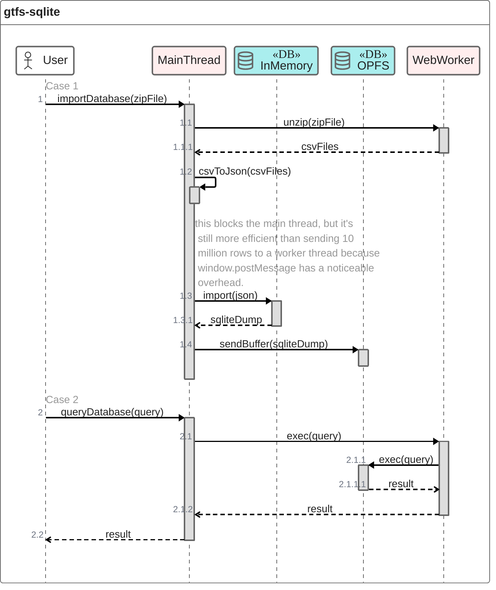

# gtfs-sqlite

[](https://github.com/k-yle/gtfs-sqlite/actions)
[](https://badge.fury.io/js/gtfs-sqlite)
[](https://www.npmjs.com/package/gtfs-sqlite)


🚌🚇 A TS/JS library to import a GTFS file into a sqlite database, completely in the browser.

Try [the demo here](https://kyle.kiwi/gtfs-sqlite).

# How it works

The sqlite database is stored in the [Origin Private File System](https://developer.mozilla.org/en-US/docs/Web/API/File_System_API/Origin_private_file_system), and accessed via [sqlite-wasm](https://github.com/sqlite/sqlite-wasm) running in a [WebWorker](https://developer.mozilla.org/en-US/docs/Web/API/Web_Workers_API) thread.

There means there is a slight overhead for each sql command, but it allows you to execute complex and expensive queries without blocking the main thread.

There is one exception: When importing a dataset, we run this in the main thread because it's significantly faster, but it will cause the browser to appear unresponsive, despite [some logic to minimise](https://developer.mozilla.org/en-US/docs/Web/API/Scheduler/yield) the sluggishness.


<!--
github can't natively render this some mermaid diagrams 🥲
source code:


--->

# Install

```sh
npm install gtfs-sqlite
```

You will need to use a bundler like vite that supports WebWorkers.

For [security reasons](https://developer.mozilla.org/en-US/docs/Web/JavaScript/Reference/Global_Objects/SharedArrayBuffer#security_requirements), you'll also need to add this logic to your `vite.config.js` file (or equivilant file for other bundlers):

```ts
import { defineConfig } from 'vite';

export default defineConfig({
  server: {
    headers: {
      'Cross-Origin-Opener-Policy': 'same-origin',
      'Cross-Origin-Embedder-Policy': 'require-corp',
    },
  },
  optimizeDeps: {
    exclude: ['@sqlite.org/sqlite-wasm'],
  },
});
```

# Usage

```ts
import {
  getAllDatabaseNames,
  importDBFromZip,
  CommsChannel,
} from 'gtfs-sqlite';

// returns a list of gtfs databases that are already stored in the browser's OPFS
await getAllDatabaseNames();

// imports a new database into the browser's OPFS storage
await importDBFromZip({
  zipFile: file, // a File or Blob object that a user uploaded
  databaseName: 'exampleDatabaseForMyCity',
  onProgress: console.log,
  exclude: ['shapes.txt'], // any files to be ignored (to save time & space)
});

// this is the main API for querying the database, it
// forwards all requests to a WebWorker.
const db = CommsChannel('exampleDatabaseForMyCity');

// for example:
await db.exec('SELECT * FROM routes');
await db.getColumns('routes'); // to check if some optional columns exist for this city
await db.dump(); // if you want to export the db to a .sqlite3 file
```

# TypeScript

This library is type-safe thanks to [gtfs-types](https://npm.im/gtfs-types). That package also defines whether columns should be imported as a `string`, `float`, or `int`, and provides enums to make queries more readable.

Example usage with TypeScript:

```ts
import { Route, Agency, VehicleType } from 'gtfs-types';

const rows = await db.exec<Route & Agency>(
  `
    SELECT * FROM routes r
    WHERE r.route_type='${VehicleType.BUS}'
    INNER JOIN agency a ON r.agency_id = a.agency_id
  `,
);
```
